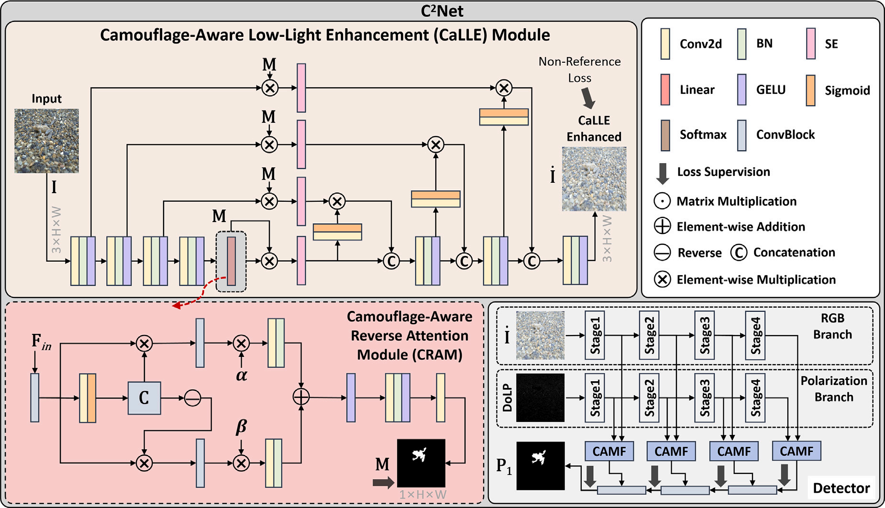
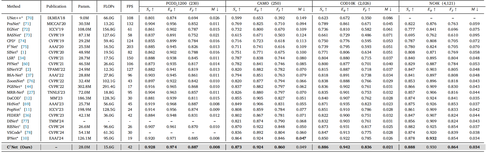
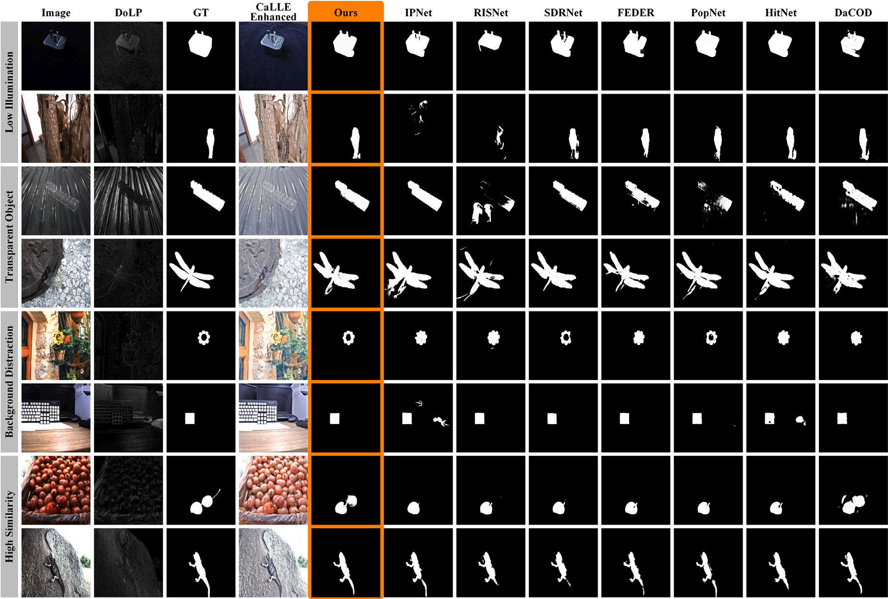

#  Camouflage-Aware Low-Light Enhancement and Cross-Attentional Mamba Fusion for RGB-P Camouflaged Object Detection (Displays 2026)

> **Authors:** 
> Weiyun Liang,
> Chunyuan Chen,
> Jing Xu,
> Bin Wang,
> and Donglin Wang

## 1. Overview

- This repository provides code for "_**Camouflage-Aware Low-Light Enhancement and Cross-Attentional Mamba Fusion for RGB-P Camouflaged Object Detection**_", Displays, 2026. [Paper](https://www.sciencedirect.com/science/article/pii/S0141938225003026) 

### 1.1. Introduction
RGB-P camouflaged object detection (COD) aims to identify objects that seamlessly blend into their surroundings by leveraging complementary cues from paired RGB and polarization images. However, existing RGB-P COD methods suffer from significant performance degradation under low-light conditions due to the low quality of polarization maps, which contain limited camouflaged object cues. Moreover, while effectively mining complementary discriminative information from multi-modal features is particularly prominent in low-light scenes, existing RGB and polarization fusion strategies often focus only on coarse feature-level fusion, lacking fine-grained alignment between the two feature spaces. To address these issues, we propose a Camouflage-aware low-light enhancement and Cross-attentional Mamba fusion network, namely C2Net, for RGB-P COD. Specifically, a camouflage-aware low-light enhancement (CaLLE) module is introduced to inject camouflage-aware semantics into the low-light enhancement process, highlighting camouflaged objects under low-light conditions. In addition, a cross-attentional Mamba fusion (CAMF) module is proposed to leverage Mamba’s state space modeling capability to perform fine-grained alignment between multi-modal feature state spaces, enabling more effective RGB-P information fusion. Extensive experiments demonstrate the proposed method achieves superior performance compared to state-of-the-art methods on four RGB-P and RGB COD benchmark datasets.

### 1.2. Framework

      
    <em> 
    Figure 1: The overall architecture of our proposed C2Net, which comprises two components: a camouflage-aware low-light enhancement (CaLLE) module and a Detector. The CaLLE module utilizes camouflage-aware reverse attention module (CRAM) to inject camouflage-aware semantics into an LLE process. The Detector utilizes a two-stream encoder to generate enhanced RGB and polarization features, four cross-attentional Mamba fusion (CAMF) modules to fuse multi-modal features, and three ConvBlocks to aggregate multi-stage features in a top-down manner.
    </em>

### 1.3. Quantitative Results

      
    <em> 
    Figure 2: Quantitative results of our method and the SOTA methods on RGB-P and RGB benchmark datasets.
    </em>

### 1.4. Qualitative Results

      
    <em> 
    Figure 3: Qualitative Comparison.
    </em>

## 2. Proposed Baseline

### 2.1. Prepare the Data

The training and testing datasets can be downloaded from https://github.com/cvhfut/PCOD_1200 and https://github.com/GewelsJI/SINet-V2/tree/main .

You can modify `config.py` to set all the data paths.

### 2.2 Training Configuration

+ Traning hyperparameters and data paths can be modified in `config.py`.

+ Pretrained weights for PVTv2 backbone can be downloaded from https://github.com/whai362/PVT/tree/v2/classification .

+ Installing necessary packages:
   + pytorch: https://pytorch.org
   + pysodmetrics: https://github.com/lartpang/PySODMetrics
   + VMamba: https://github.com/zifuwan/Sigma
  
### 2.3 Training, Inference, and Testing

+ Run `train.py` to train the model.

+ Run `inference.py` to generate the prediction maps. Set path to your trained checkpoint (`pth_path`).

+ Run `evaluate.py` to calculate the evaluation metrics for the prediction maps. Set path to your predictions (`pred_path`).

## 3. Pre-computed Maps

[Google Drive](https://drive.google.com/file/d/1M0k4bHhjLBiRlBdF_yd2sRnLrOTRuaja/view) or [Baidu Drive](https://pan.baidu.com/s/11VKWlYJU4fQ2e1iuRP9-fA) (extraction code: hraa)

## 4. Citation

Please cite our paper if you find the work useful, thanks!
	
    @article{LIANG2026103265,
    title = {Camouflage-aware low-light enhancement and cross-attentional Mamba fusion for RGB-P camouflaged object detection},
    journal = {Displays},
    volume = {91},
    pages = {103265},
    year = {2026},
    author = {Weiyun Liang and Chunyuan Chen and Jing Xu and Bin Wang and Donglin Wang},
    }

## Acknowledgement

The code is built on [Sigma](https://github.com/zifuwan/Sigma), [Zero-DCE](https://github.com/Li-Chongyi/Zero-DCE), and [SINetV2](https://github.com/GewelsJI/SINet-V2). Please also follow the corresponding licenses. Thanks for their awesome work.

    
**[⬆ back to top](#1-overview)**
